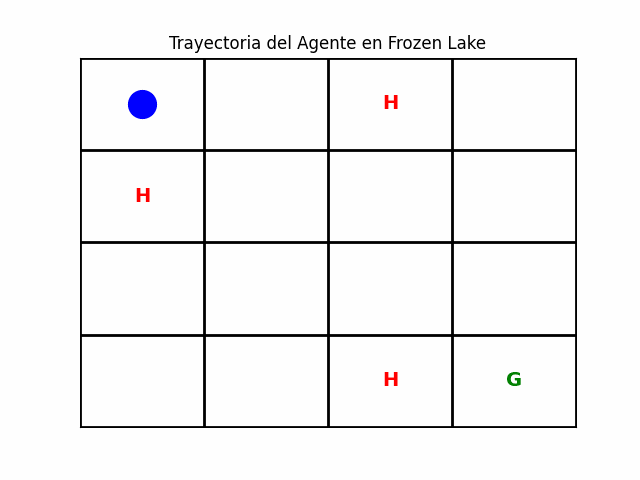

# **Hoja de Trabajo 2 - Inteligencia Artificial**

- [Mónica Salvatierra - 22249](https://github.com/alee2602)
- [Paula Barillas - 22764](https://github.com/paulabaal12)
- [Derek Arreaga - 22537](https://github.com/FabianKel)


#####  LINK DE REPOSITORIO
https://github.com/FabianKel/HDT2-IA

#### LINK DE VIDEO DE DEMOSTRACIÓN
https://youtu.be/ZCvyHMbXuF8

## Introducción
Esta hoja de trabajo consiste en el desarrollo de un agente basado en **Iteración de Valores** para resolver un **Proceso de Decisión de Markov (MDP)** en un entorno similar al problema **Frozen Lake**.

## **¿Qué es el problema Frozen Lake?**
El **Frozen Lake** es un entorno simulado que representa un lago congelado dividido en una cuadrícula. El objetivo es que un agente se mueva desde un punto inicial hasta una meta sin caer en agujeros en el hielo.

### **Elementos del entorno**
1. **Punto inicial (Start)**: Esquina superior izquierda de la cuadrícula.
2. **Punto de meta (Goal)**: Esquina inferior derecha de la cuadrícula.
3. **Hielo seguro (Frozen)**: Casillas por las que el agente puede moverse sin problemas.
4. **Hoyos (Holes)**: Casillas que, si el agente cae en ellas, terminan el episodio con una recompensa negativa.
5. **Acciones**: El agente puede moverse en 4 direcciones: **arriba, abajo, izquierda o derecha**.

## **Descripción de Archivos**
### **Código fuente**
- **`main.py`**: Archivo principal que ejecuta todas las funciones del programa.
- **`environment.py`**: Crea el entorno de la cuadrícula, define el estado inicial, el objetivo y los hoyos.
- **`value_iteration.py`**: Implementa el algoritmo de **Iteración de Valores** para calcular la política óptima.
- **`policy.py`**: Extrae la mejor política basada en los valores calculados por `value_iteration.py`.
- **`agent.py`**: Simula el movimiento del agente en la cuadrícula siguiendo la política óptima.
- **`animation.py`**: Genera una animación de la trayectoria del agente y permite guardarla como un **GIF**.

## **Ejecución del Programa**
Para ejecutar el código, asegúrate de tener **Python 3** instalado y las siguientes librerías:

```bash
pip install numpy matplotlib pillow
```

Luego, ejecuta el script principal:

```bash
python main.py
```

Esto generará la política óptima y mostrará la trayectoria del agente en la cuadrícula. También guardará un archivo **GIF** con la animación de la trayectoria en `trayectoria_agente.gif`.

## **Ejemplo de Salida**
Ejecutando el código, se imprimirá en la terminal:

```
Política óptima:
[['RIGHT' 'RIGHT' 'DOWN' 'DOWN']
 ['UP' 'LEFT' 'DOWN' 'DOWN']
 ['RIGHT' 'UP' 'RIGHT' 'DOWN']
 ['RIGHT' 'RIGHT' 'RIGHT' 'GOAL']]

Camino óptimo: [(0,0), (0,1), (0,2), (1,2), (2,2), (2,3), (3,3)]
GIF guardado correctamente!
```

## **Visualización del GIF**
El resultado de la trayectoria del agente se encuentra en **trayectoria_agente.gif**, donde se muestra cómo se mueve desde la posición inicial hasta la meta evitando los hoyos.

<center>



- Para generar un mapa distinto se puede cambiar el valor de la semilla en [environment.py](/enviroment.py), línea 10
</center>